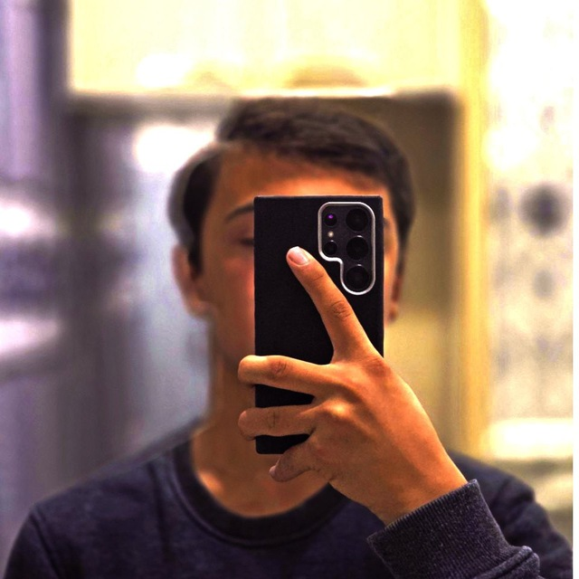

<!DOCTYPE html>
<html lang="en">
<head>
    <meta charset="UTF-8">
    <meta name="viewport" content="width=device-width, initial-scale=1.0">
    <link rel="stylesheet" href="css/portfoliyo.css">
    <link rel="web icon" href="imgs/shahruh-img.jpg">
</head>
<body>
    <nav class="navbar">
        

            <h1 class="nav__title">
                <a href="portfoliyo.html">
                    Duschanov Shahruh
                </a>
            </h1>
            <ul class="nav__list">
                <li class="nav__item"><a href="portfoliyo.html" class="nav__link home">Home</a></li>
                <li class="nav__item"><a href="#about" class="nav__link about">About</a></li>
                <li class="nav__item"><a href="#skills" class="nav__link skills">Skills</a></li>
                <li class="nav__item"><a href="#contact" class="nav__link contact">Contact</a></li>
            </ul>
        

    </nav>
    <header class="header">
        

            

                

                    
Hello, my name is

                    <h1 class="header__card-title">
                        Duschanov Shahruh
                    </h1>
                    <h3 class="header__card-title-two">Front-End Developer</h3>
                    
Men HTML, CSS, JavaScript va React.js bilan ishlayman. Amaliy loyihalarda ishtirok etib, o’z ko’nikmalarimni rivojlantirishni xohlayman. Jamoada ishlash va yangi texnologiyalarni o’rganishni yaxshi ko’raman.

                    

                            <a href="resume/resume.pdf" class="header__card-btn btn">Resume (PDF)</a>
                            <a href="#" class="header__card-btn btn">Contact me</a>
                    

                

                

                    

                        
                        

                            <h3 class="header__card-img-title">Duschanov Shahruhbek</h3>
                            
Front-End Developer

                        

                    

                    <ul class="header__card-img-list">
                        <li class="header__card-img-item">
                            <strong>Email:</strong>
                            duschanovabushahruhbek@gmail.com
                        </li>
                        <li class="header__card-img-item">
                            <strong>Telefon:</strong>
                            +998 99 913 89 99
                        </li>
                        <li class="header__card-img-item">
                            <strong>Manzil:</strong>
                            Xorazm viloyati, Xonqa tumani, Madaniyer mahallasi
                        </li>
                    </ul>
                    <h4 class="header__card-img-title-two">Qisqacha ma'lumot</h4>
                    
Men web-dasturlashda chuqur qiziqaman. HTML/CSS, JavaScript va React bo'yicha loyihalar quraman. Tez o'rganaman va jamoada samarali ishlayman.

                

            

        

    </header>
    <main class="main">
        <section id="about">
            

                <h2 class="about__title">
                    About me
                </h2>
                

                    Men — Front-end yo'nalishida ishlaydigan dasturchiman. Hozirgacha o'zimni mustaqil loyihalarda sinab ko'rdim va portfolio to'plash ustidaman. Fikr-mulohaza olish va hamkorlik qilishga ochiqman.
                

            
 
        </section>
        <section id="skills">
            

                <h1 class="skills__title">Skills</h1>
                

                    

                        <h1 class="skills__card-title">
                            75%
                        </h1>
                        

                            Html
                        

                    

                    

                        <h1 class="skills__card-title">
                            50%
                        </h1>
                        

                            Css
                        

                    

                    

                        <h1 class="skills__card-title">
                            15%
                        </h1>
                        

                            JavaScript
                        

                    

                

            

        </section>
        <section id="contact">
            

                <h1 class="contact__title">
                    Contact me
                </h1>
                

                    

                        <form class="contact__form">
                            

                                <label for="">
                                    Ism
                                </label>
                                <input type="text" placeholder="Ismingizni yozing" required>
                            

                            

                                <label for="">
                                    Email
                                </label>
                                <input type="email" placeholder="email@example.com" required>
                            

                            

                                <label for="">
                                    Xabar
                                     
                                </label>
                                <textarea name="Message" id="Message" placeholder="Xabaringiz....." rows="4" cols="5" class="input"></textarea>
                            

                            <button class="contact__form-btn btn">Yuborish</button>           
                        </form>
                    

                    

                        <h3 class="contact__card-title">
                            Boshqa kontaktlar
                        </h3>
                        <ul class="header__card-img-list">
                            <li class="header__card-img-item">
                                <strong>Email:</strong>
                                duschanovabushahruhbek@gmail.com
                            </li>
                            <li class="header__card-img-item">
                                <strong>Telefon:</strong>
                                +998 99 913 89 99
                            </li>
                            <li class="header__card-img-item">
                                <strong>Github:</strong>
                                <a href="https://github.com/Shahruhbek-desinger" class="contact__card-img-link"> github.com/Shahruhbek-desinger</a>
                            </li>
                        </ul>                    
                    

                

            

        </section>
    </main>
    <footer class="footer">
        

            

                ©2025 Samandarov Shokirjon. All rights reserved.
            

        

    </footer>
</body>
</html>
